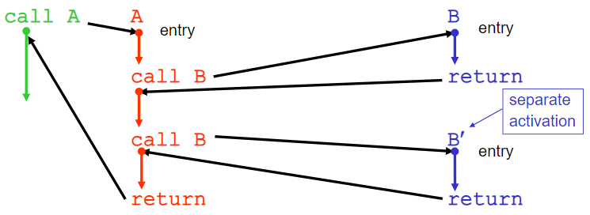
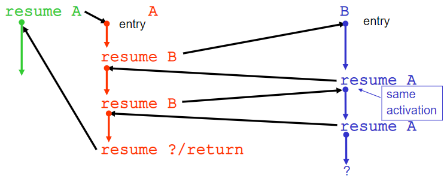

1. [ JVM Thread. ](#1)
2. [ Coroutine. ](#2)

## 1. JVM Thread

sometext

## 2. Coroutine
- Terminology
  - **Main**routine
    - 프로그램이 실행될 때의 시작되는 entry-point
  - **Sub**routine
  
    - 하나의 진입 지점을 갖는 실행 가능한 코드 블럭으로, 언어에 따라 precedure, function, routine, method, subprogram 등으로 불린다.
    - 특징
      - return a computed value to its caller
      - have side effects
      - call itself recursively
      
      
  - **Co**routine
  
    - 하나 이상의 진입 지점을 가질 수 있는 Subroutine
  
  
  
  하나의 진입 지점을 갖는 실행 가능한 코드 블럭으로, 언어에 따라 precedure, function, routine, method, subprogram 등으로 불린다.
  - Co-Routine: 하나의 진입 지점을 갖는 실행 가능한 코드 블럭이며, 동시에 하나 이상의 재진입점을 갖는다.

- Comparison with Threads
