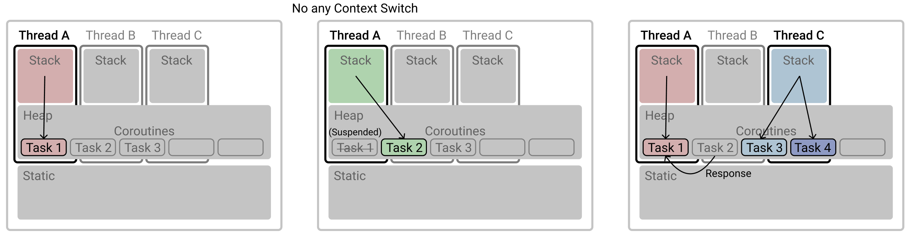

1. [ Thread. ](#1)
2. [ Coroutine. ](#2)
3. [ Examples. ](#3)

<a name="1"></a>
## 1. Thread
- Thread는 동시성의 가장 기본이 되는 단위로 비동기 동시성을 제공하기 위한 빌딩 블록이다. 
- Thread는 상호배제(mutual exclusion) 원칙에 따라 특정 데이터에 접근은 오직 하나의 Thread만 가능하다
- OS의 Preemping Scheduler 에 의해 Thread를 결정하고 작업을 수행함으로써 동시성을 보장한다.
  - Thread 생성/삭제
  - Context Switching


<a name="2"></a>
## 2. Coroutine
- **Coroutines are like very light-weight threads**
```
fun main(args: Array<String>) = runBlocking<Unit> {
  val jobs = List(100_000) {
      launch {
          delay(1000L)
          print(".")
      }
  }
  jobs.forEach { it.join() }
}

fun print(s: String) {
    val current = LocalDateTime.now()
    println("[${Thread.currentThread().name}][$current] $s")
}
```
```
[main @coroutine#79443][2019-08-06T00:00:16.083] .
[main @coroutine#79444][2019-08-06T00:00:16.083] .
[main @coroutine#79445][2019-08-06T00:00:16.083] .
...
[main @coroutine#99999][2019-08-06T00:00:16.236] .
[main @coroutine#100000][2019-08-06T00:00:16.236] .
[main @coroutine#100001][2019-08-06T00:00:16.238] .
```
- coroutin은 `CoroutineScope` interface를 통해 CoroutineContext를 정의하고, launch를 통해 실행된다.
  - [CoroutineScope](https://kotlin.github.io/kotlinx.coroutines/kotlinx-coroutines-core/kotlinx.coroutines/-coroutine-scope/index.html)
  - [CoroutineContext](https://kotlin.github.io/kotlinx.coroutines/kotlinx-coroutines-core/kotlinx.coroutines/-coroutine-scope/coroutine-context.html)
  

- 위를 coroutine이 아니라 thread로 변경하면??
```
fun main(args: Array<String>) = runBlocking<Unit> {
  val jobs = List(100_000) {
      thread {
          Thread.sleep(1000L)
          print(".")
      }
  }
  jobs.forEach { it.join() }
}
```
```
Exception in thread "main" java.lang.OutOfMemoryError: unable to create new native thread
```

- Coroutine은 Thread와 동일하게 Concurrency를 제공하며, 하나 이상의 진입 지점을 갖는 Subroutine이다.
  - Subroutine
    - 하나의 진입 지점을 갖는 실행 가능한 코드 블럭으로, 언어에 따라 precedure, function, routine, method, subprogram 등으로 불린다.
      - return a computed value to its caller
      - have side effects
      - call itself recursively
- Stackful coroutines(=Fibers) 은 별도의 stack을 갖고 couroutine 객체는 JVM Heap에 할당된다.
- 사용자 스케쥴러에 의해 life-time을 갖는다.
- 여러 Thread에서 하나의 coroutine이 실행될 수 있다.
- Thread와 달리 coroutine 끼리는 선점형(preemptive)이 아니라 협력형(cooperate) 멀티태스킹 방식을 사용한다.
- OS가 아닌 User에 의해 context switching이 발생한다. 물론 OS에 의해 fiber가 동작 중인 thread가 해제될 순 있다. 
- fiber에서 수행되는 I/O 작업의 경우 만드시 비동기로 해야 다른 fiber가 blocking 되지 않는다. 

- 

    
## 3. Example
- 책의 예제가 쓰레기라 공식 문서 내용을 설명합니다.

### 3-1. Coroutines basics
```
package kotlinx.coroutines.guide.basic01

import kotlinx.coroutines.*
import java.time.LocalDateTime

fun main() {
    GlobalScope.launch { // launch a new coroutine in background and continue
        delay(1000L) // non-blocking delay for 1 second (default time unit is ms)
        print("World!") // print after delay
    }
    print("Hello,") // main thread continues while coroutine is delayed
    Thread.sleep(2000L) // block main thread for 2 seconds to keep JVM alive
}

fun print(s: String) {
    val current = LocalDateTime.now()
    println("[${Thread.currentThread().name}][$current] $s")
}
```

```
[main][2019-08-05T23:47:21.417] Hello,
[DefaultDispatcher-worker-1 @coroutine#1][2019-08-05T23:47:22.387] World!

Process finished with exit code 0
```
- `CoroutineScope` context의 launch 함수를 통해 coroutine builder를 실행한다.
  - `GlobalScope`: A global CoroutineScope not bound to any job.
  
### 3-2. Cancellation and timeouts
```
import kotlinx.coroutines.*

fun main() = runBlocking {
//sampleStart
    val job = launch {
        repeat(1000) { i ->
            println("job: I'm sleeping $i ...")
            delay(500L)
        }
    }
    delay(1300L) // delay a bit
    println("main: I'm tired of waiting!")
    job.cancel() // cancels the job
    job.join() // waits for job's completion 
    println("main: Now I can quit.")
}
```
```
job: I'm sleeping 0 ...
job: I'm sleeping 1 ...
job: I'm sleeping 2 ...
main: I'm tired of waiting!
main: Now I can quit.
```
- 이처럼 coroutine은 long-running job의 경우 Job 객체를 리턴하여 cancel할 수 있다.

### 3-3. Composing suspending functions
```
import kotlinx.coroutines.*
import kotlin.system.*

fun main() = runBlocking<Unit> {
//sampleStart
    val time = measureTimeMillis {
        val one = doSomethingUsefulOne()
        val two = doSomethingUsefulTwo()
        println("The answer is ${one + two}")
    }
    println("Completed in $time ms")
//sampleEnd    
}

suspend fun doSomethingUsefulOne(): Int {
    delay(1000L) // pretend we are doing something useful here
    return 13
}

suspend fun doSomethingUsefulTwo(): Int {
    delay(1000L) // pretend we are doing something useful here, too
    return 29
}
```
- `suspend` keyword는 coroutine builder를 통해 
- 기본적으로 코드는 순차적으로 수행되며, 위 예제와 같이 coroutine 역시 순차적으로 수행된다.  


### 3-4. Coroutine context and dispatchers
### 3-5. Exception handling
### 3-6. Supervision
### 3-7. Channels
### 3-8. Shared mutable state and concurrency
### 3-9. Select expression (experimental)
